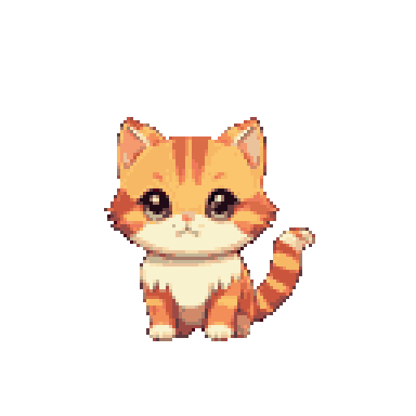
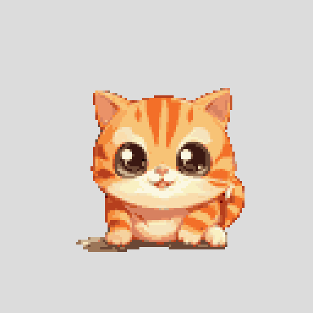

<p align="center">
  
  
</p>

<h1 align="center">🐾 桌宠学习陪伴</h1>
<p align="center"><strong>Desktop Pet Study Companion</strong></p>

<p align="center">
  
  
  
  
  
</p>

<p align="center">
  一只住在你桌面右下角的像素风小橘猫。<br>
  你专注学习，它陪你成长；你偷懒摸鱼，它闹脾气撒娇。<br>
  用宠物的状态反馈，把学习转化为即时奖励和陪伴感。
</p>

---

## ✨ 特色

- 🪟 **透明无边框桌面宠物** — 住在屏幕右下角，不挡视线，随时可见
- 🐱 **14 种可收集宠物** — 从新手青蛙到传说独角兽，各有稀有度和专属性格
- 🌱 **成长进化系统** — 幼年→少年→成年，300 个成长点数见证蜕变
- ⏱️ **专注计时器** — 番茄钟 + 金币奖励 + 连续天数加成，学习即赚钱
- 🛒 **商店 & 背包** — 买食物、玩具、装扮，右键投喂互动
- 🎭 **5 种宠物性格** — 黏人/傲娇/懒散/努力/贪吃，对话风格各不相同
- 💬 **对话气泡** — 按状态匹配台词，饿了叫、开心笑、脏了嫌弃
- 🎨 **像素风动画素材** — AI 生成 + 后处理管线，复古 GameBoy 风味
- 💾 **本地存档** — JSON 存储 + 3 份自动备份，数据安全
- 🔔 **系统托盘驻留** — 关闭即隐藏，托盘图标常驻，不打扰

---

## 🎬 当前素材 (v1.5.0)

<p align="center">
  <b>橘猫 · 幼年阶段</b><br>
  <i>像素风 RGBA 透明背景 · 10 帧循环 · 512×512</i>
</p>

| 状态 | 动画 | 触发条件 |
|------|------|----------|
| 🫁 **idle** |  | 默认待机 |
| 🎉 **happy** |  | 心情 > 80 或 鼠标悬停 |
| 😿 sad | — | 心情 < 20 |
| 🍽️ hungry | — | 饥饿 < 25 |
| 💤 sleeping | — | 精力 < 15 |
| 🎾 playing | — | 右键→玩耍 或 拖拽 |
| 😤 angry | — | 长期被忽略 |
| 🛁 dirty | — | 清洁 < 25 |

> 素材通过 AI 生图管线生成：通义万相 / 智谱 CogView → rembg 去背景 → 像素化量化 → RGBA PNG → GIF 合成。详见 [`tools/`](../tools/) 目录。

---

## 🚀 快速开始

### 环境
- **Node.js** ≥ 18
- **npm** (Windows 使用 `npm.cmd`)
- **Windows** / macOS / Linux

### 安装 & 运行

```bash
git clone https://github.com/meowowowrita/desktop-pet-study-companion.git
cd desktop-pet-study-companion
npm install
npm run dev
```

启动后：
- 宠物窗口自动出现在屏幕右下角
- **右键点击宠物** → 快捷菜单（喂食/洗澡/玩耍/控制面板）
- **系统托盘右键** → 打开控制面板 / 退出
- **左键拖拽** → 移动宠物位置

### 构建

```bash
npm run build       # electron-vite 构建
npm run package     # electron-builder 打包（配置已就绪）
```

---

## 🏗️ 技术栈

| 层 | 技术 |
|---|------|
| 桌面框架 | Electron 33 + electron-vite |
| 前端 | React 18 + TypeScript 5.7 |
| 状态管理 | Zustand 5 |
| 存储 | JSON 文件（3 份轮转备份 + 版本迁移） |
| 素材 | 自定义 `asset://` 协议（Range 请求 + MIME 识别） |
| 生图 | 通义万相 / 智谱 CogView → rembg + Pillow 后处理 |

---

## 📁 项目结构

```
src/
├── main/           # Electron 主进程（窗口/托盘/IPC/协议/tick）
├── preload/        # contextBridge 安全桥接
├── renderer/       # React 前端
│   ├── routes/     # PetWindow / ControlPanel
│   └── components/ # PetSprite / DialogueBubble / QuickMenu / ShopPanel ...
└── shared/         # 共享类型 + 游戏逻辑纯函数
    ├── data/       # 宠物种类 / 性格 / 物品 配置
    └── game/       # 宠物状态 / 专注奖励 / 商店 / 生命周期

assets/
└── pets/{species}/{stage}/
    ├── idle.gif / idle.mp4    # GIF 优先，mp4 兜底
    ├── happy.gif, sad.gif ...
    ├── frame_*.png            # 原始帧序列
    └── metadata.json          # 帧信息

tools/              # AI 生图管线（独立于应用）
├── config/         # 管线配置 + 角色设定
├── generators/     # API 后端（通义万相 / 智谱 CogView）
├── pipeline.py     # 主编排：生成 → 后处理 → QA → 联系表
├── postprocess.py  # rembg 去背景 + 像素化 + 锚点对齐
├── contact_sheet.py # 联系表 + 叠加一致性检查
└── qa_checker.py   # 自动 QA + 不合格标记
```

---

## 🗺️ 路线图

| 版本 | 主题 |
|------|------|
| **v1.5** ✅ | 精灵帧序列生成管线 · 像素风 GIF 素材系统 · idle/happy 动画 |
| **v1.6** | 全 8 状态动画素材 · 角色一致性参考图生图 |
| **v1.7** | 多宠物购买/切换 UI · 宠物图鉴 |
| **v2.0** | 成长进化视觉 · 装扮系统 · 音效 |
| **v2.5** | WebView 学习行为跟踪 · 自动计时 |
| **v3.0** | LLM 驱动对话 · 宠物个性记忆 · 学习建议 |

---

## 🤖 AI 协作

本项目采用 **Codex 架构师 + Claude Code Worker** 的 AI 协作模式：

- `AGENTS.md` — 主代理行为规则
- `CLAUDE.md` — Worker 行为约束  
- `docs/AI_COLLABORATION_WORKFLOW.md` — 工作流定义

所有代码生成、素材管线、测试验证均通过 Claude Code CLI 子代理完成。

---

## 📄 License

MIT © 2026

---

<p align="center">
  <sub>Made with 🐾 and AI</sub>
</p>
